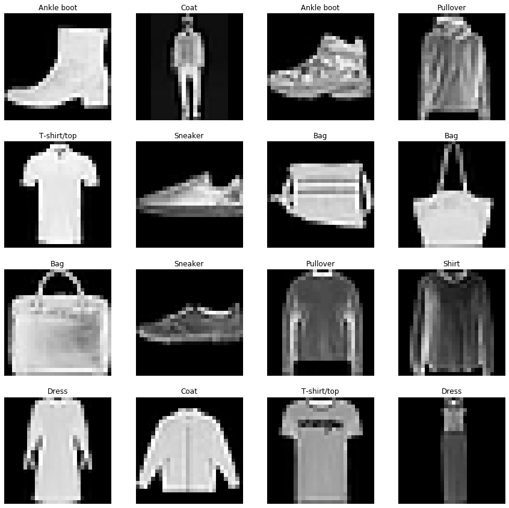
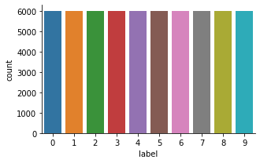
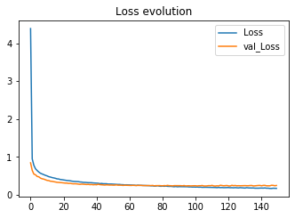
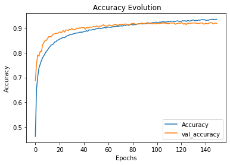
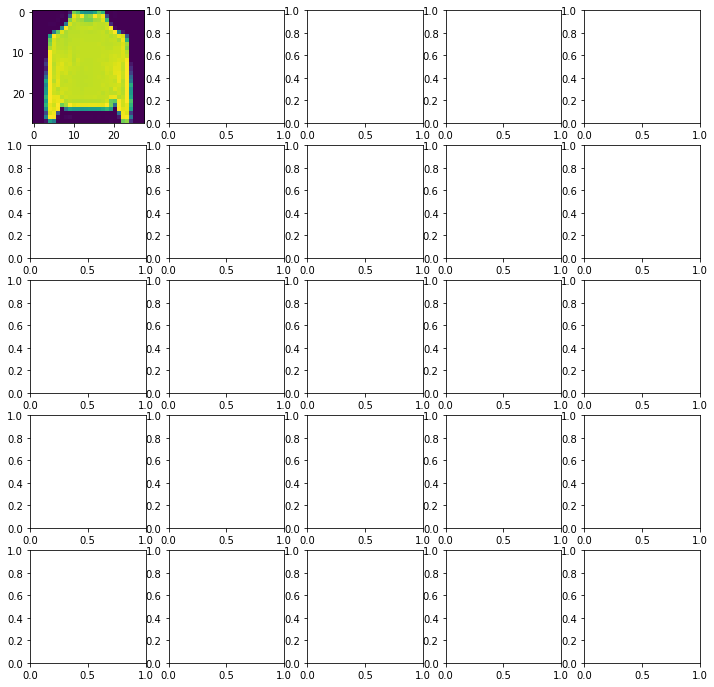
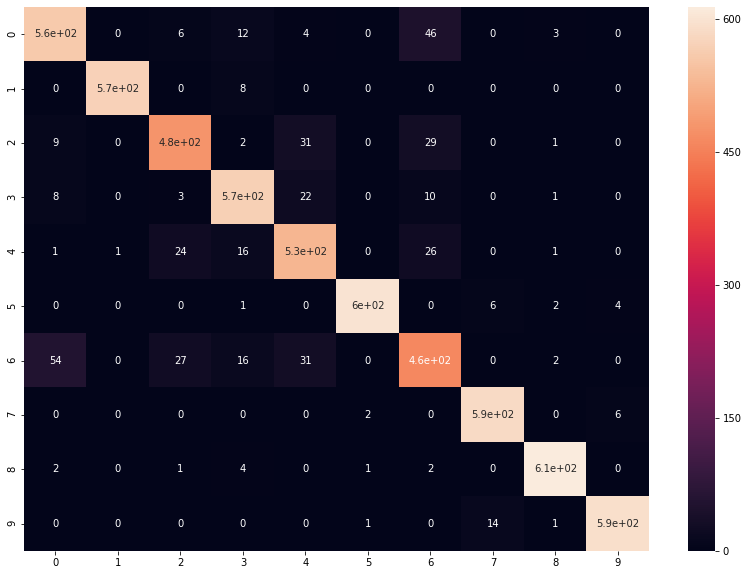

# Importing libraries


```python
import numpy as np
import matplotlib.pyplot as plt
import pandas as pd
import seaborn as sns
import keras
import tensorflow as tf
```

    Using TensorFlow backend.
    


```python
train = pd.read_csv('C:/Users/pc/Desktop/Fashion MNIST/fashion-mnist_train.csv')
test = pd.read_csv('C:/Users/pc/Desktop/Fashion MNIST/fashion-mnist_test.csv')
df = train.copy()
test_df = test.copy()
print("Dataset imported succesfully")
```

    Dataset imported succesfully
    


```python
#view starting values of data set
print("Dataset Head")
print(train.head())
print("=" * 30)
```

    Dataset Head
       label  pixel1  pixel2  pixel3  pixel4  pixel5  pixel6  pixel7  pixel8  \
    0      2       0       0       0       0       0       0       0       0   
    1      9       0       0       0       0       0       0       0       0   
    2      6       0       0       0       0       0       0       0       5   
    3      0       0       0       0       1       2       0       0       0   
    4      3       0       0       0       0       0       0       0       0   
    
       pixel9  ...  pixel775  pixel776  pixel777  pixel778  pixel779  pixel780  \
    0       0  ...         0         0         0         0         0         0   
    1       0  ...         0         0         0         0         0         0   
    2       0  ...         0         0         0        30        43         0   
    3       0  ...         3         0         0         0         0         1   
    4       0  ...         0         0         0         0         0         0   
    
       pixel781  pixel782  pixel783  pixel784  
    0         0         0         0         0  
    1         0         0         0         0  
    2         0         0         0         0  
    3         0         0         0         0  
    4         0         0         0         0  
    
    [5 rows x 785 columns]
    ==============================
    


```python
# View How many samples and how many missing values for each feature
print("Dataset Features Details")
print(train.info())
print("=" * 30)
```

    Dataset Features Details
    <class 'pandas.core.frame.DataFrame'>
    RangeIndex: 60000 entries, 0 to 59999
    Columns: 785 entries, label to pixel784
    dtypes: int64(785)
    memory usage: 359.3 MB
    None
    ==============================
    

# Exploring the dataset
it is iportant to note that Label is the Target variable.

# Dataset Label Description
0 T-shirt/top

1 Trouser

2 Pullover

3 Dress

4 Coat

5 Sandal

6 Shirt

7 Sneaker

8 Bag

9 Ankle boot

# Examine Dimensions


```python
print('Train: ', df.shape)
print('Test: ', test_df.shape)
```

    Train:  (60000, 785)
    Test:  (10000, 785)
    

So, there are 60,000 Training Samples and 10,000 Test Samples.
Each example is a 28x28 grayscale image, associated with a label from 10 classes.


```python
df.label.unique()
```


    array([2, 9, 6, 0, 3, 4, 5, 8, 7, 1], dtype=int64)


# Checking for Null Values


```python
 #Train DATASET
df.isnull().any().sum()
```


    0


```python
# Test DATASET
test_df.isnull().any().sum()
```


    0


Wonderful, So there are no Null Values in both Train and Test Set.

# Visualizing the Dataset


```python
# Mapping Classes lebels
clothes = {0 : 'T-shirt/top',
            1 : 'Trouser',
            2 : 'Pullover',
            3 : 'Dress',
            4 : 'Coat',
            5 : 'Sandal',
            6 : 'Shirt',
            7 : 'Sneaker',
            8 : 'Bag',
            9 : 'Ankle boot'}
```

Plotting Random Images


```python
fig, axes = plt.subplots(4, 4, figsize = (15,15))
for row in axes:
    for axe in row:
        index = np.random.randint(60000)
        img = df.drop('label', axis=1).values[index].reshape(28,28)
        cloths = df['label'][index]
        axe.imshow(img, cmap='gray')
        axe.set_title(clothes[cloths])
        axe.set_axis_off()
```





Let's look at the Distribution of labels to anaylze if there are any skewed classes


```python
df['label'].value_counts()
```


    9    6000
    8    6000
    7    6000
    6    6000
    5    6000
    4    6000
    3    6000
    2    6000
    1    6000
    0    6000
    Name: label, dtype: int64


```python
sns.factorplot(x='label', data=df, kind='count', size=3, aspect= 1.5)
```

    C:\Users\pc\Anaconda3\lib\site-packages\seaborn\categorical.py:3666: UserWarning: The `factorplot` function has been renamed to `catplot`. The original name will be removed in a future release. Please update your code. Note that the default `kind` in `factorplot` (`'point'`) has changed `'strip'` in `catplot`.
      warnings.warn(msg)
    C:\Users\pc\Anaconda3\lib\site-packages\seaborn\categorical.py:3672: UserWarning: The `size` paramter has been renamed to `height`; please update your code.
      warnings.warn(msg, UserWarning)
    


    <seaborn.axisgrid.FacetGrid at 0x1dd85682d68>





It beautiful that all classes are equally Distributed.There is no anomalies in the dataset


```python
# Setting Random Seeds for Reproducibilty.
seed = 66
np.random.seed(seed)
```

# Split the data into train/validation/test datasets
Now we are gonna split the training data into Train and Validation Set. 

Train set is used for Training the model and Validation set is used for Evaluating our Model's Performance on the Dataset.


```python
from sklearn.model_selection import train_test_split
X = train.iloc[:,1:]
Y = train.iloc[:,0]
x_train, x_validate, y_train, y_validate = train_test_split(x_train, y_train, test_size = 0.2, random_state = 12345)
```


```python
x_train.shape

```


    (43200, 28, 28, 1)


```python
x_test.shape
```


    (6000, 28, 28, 1)


```python
# * unpack the tuple
x_train = x_train.reshape(x_train.shape[0], *(28, 28, 1))
x_test = x_test.reshape(x_test.shape[0], *(28, 28, 1))
x_validate = x_validate.reshape(x_validate.shape[0], *(28, 28, 1))
```

The first parameter in reshape indicates the number of examples.
 We pass it as -1, which means that it is an unknown dimension and we want numpy to figure it out.


```python
print(x_train.shape)
print(x_train.shape)
print(x_validate.shape)
```

    (43200, 28, 28, 1)
    (43200, 28, 28, 1)
    (10800, 28, 28, 1)
    

# Building the Model 


```python
from keras.models import Sequential
from keras.layers import Conv2D, MaxPooling2D, Dense, Flatten, Dropout
from keras.optimizers import Adam
from keras.callbacks import TensorBoard
```


```python
model = tf.keras.Sequential()
# Must define the input shape in the first layer of the neural network
model.add(tf.keras.layers.Conv2D(filters=64, kernel_size=2, padding='same', activation='relu', input_shape=(28,28,1))) 
model.add(tf.keras.layers.MaxPooling2D(pool_size=2))
model.add(tf.keras.layers.Dropout(0.3))
model.add(tf.keras.layers.Conv2D(filters=32, kernel_size=2, padding='same', activation='relu'))
model.add(tf.keras.layers.MaxPooling2D(pool_size=2))
model.add(tf.keras.layers.Dropout(0.3))
model.add(tf.keras.layers.Flatten())
model.add(tf.keras.layers.Dense(256, activation='relu'))
model.add(tf.keras.layers.Dropout(0.5))
model.add(tf.keras.layers.Dense(10, activation='softmax'))
# Take a look at the model summary
model.summary()
```

    WARNING:tensorflow:From C:\Users\pc\Anaconda3\lib\site-packages\tensorflow\python\ops\init_ops.py:1251: calling VarianceScaling.__init__ (from tensorflow.python.ops.init_ops) with dtype is deprecated and will be removed in a future version.
    Instructions for updating:
    Call initializer instance with the dtype argument instead of passing it to the constructor
    Model: "sequential"
    _________________________________________________________________
    Layer (type)                 Output Shape              Param #   
    =================================================================
    conv2d (Conv2D)              (None, 28, 28, 64)        320       
    _________________________________________________________________
    max_pooling2d (MaxPooling2D) (None, 14, 14, 64)        0         
    _________________________________________________________________
    dropout (Dropout)            (None, 14, 14, 64)        0         
    _________________________________________________________________
    conv2d_1 (Conv2D)            (None, 14, 14, 32)        8224      
    _________________________________________________________________
    max_pooling2d_1 (MaxPooling2 (None, 7, 7, 32)          0         
    _________________________________________________________________
    dropout_1 (Dropout)          (None, 7, 7, 32)          0         
    _________________________________________________________________
    flatten (Flatten)            (None, 1568)              0         
    _________________________________________________________________
    dense (Dense)                (None, 256)               401664    
    _________________________________________________________________
    dropout_2 (Dropout)          (None, 256)               0         
    _________________________________________________________________
    dense_1 (Dense)              (None, 10)                2570      
    =================================================================
    Total params: 412,778
    Trainable params: 412,778
    Non-trainable params: 0
    _________________________________________________________________
    


```python
model.compile(loss ='sparse_categorical_crossentropy', optimizer='adam' ,metrics =['accuracy'])

```


```python
epochs = 150

history = cnn_model.fit(x_train, y_train, batch_size = 512, epochs = epochs,
                        verbose = 1, validation_data = (x_validate, y_validate))
```

    Train on 43200 samples, validate on 10800 samples
    Epoch 1/150
    43200/43200 [==============================] - 76s 2ms/sample - loss: 4.3887 - acc: 0.4623 - val_loss: 0.8466 - val_acc: 0.6875
    Epoch 2/150
    43200/43200 [==============================] - 73s 2ms/sample - loss: 0.9502 - acc: 0.6544 - val_loss: 0.6472 - val_acc: 0.7543
    Epoch 3/150
    43200/43200 [==============================] - 73s 2ms/sample - loss: 0.7803 - acc: 0.7049 - val_loss: 0.5486 - val_acc: 0.7912
    Epoch 4/150
    43200/43200 [==============================] - 71s 2ms/sample - loss: 0.6893 - acc: 0.7388 - val_loss: 0.5318 - val_acc: 0.7856
    Epoch 5/150
    43200/43200 [==============================] - 71s 2ms/sample - loss: 0.6426 - acc: 0.7534 - val_loss: 0.4876 - val_acc: 0.8058
    Epoch 6/150
    43200/43200 [==============================] - 72s 2ms/sample - loss: 0.6032 - acc: 0.7686 - val_loss: 0.4773 - val_acc: 0.8037
    Epoch 7/150
    43200/43200 [==============================] - 72s 2ms/sample - loss: 0.5719 - acc: 0.7796 - val_loss: 0.4438 - val_acc: 0.8319
    Epoch 8/150
    43200/43200 [==============================] - 72s 2ms/sample - loss: 0.5530 - acc: 0.7882 - val_loss: 0.4262 - val_acc: 0.8419
    Epoch 9/150
    43200/43200 [==============================] - 72s 2ms/sample - loss: 0.5355 - acc: 0.7971 - val_loss: 0.4175 - val_acc: 0.8485
    Epoch 10/150
    43200/43200 [==============================] - 72s 2ms/sample - loss: 0.5166 - acc: 0.8053 - val_loss: 0.4020 - val_acc: 0.8494
    Epoch 11/150
    43200/43200 [==============================] - 71s 2ms/sample - loss: 0.5024 - acc: 0.8104 - val_loss: 0.3837 - val_acc: 0.8569
    Epoch 12/150
    43200/43200 [==============================] - 70s 2ms/sample - loss: 0.4818 - acc: 0.8186 - val_loss: 0.3787 - val_acc: 0.8648
    Epoch 13/150
    43200/43200 [==============================] - 71s 2ms/sample - loss: 0.4718 - acc: 0.8245 - val_loss: 0.3624 - val_acc: 0.8648
    Epoch 14/150
    43200/43200 [==============================] - 72s 2ms/sample - loss: 0.4584 - acc: 0.8309 - val_loss: 0.3587 - val_acc: 0.8645
    Epoch 15/150
    43200/43200 [==============================] - 70s 2ms/sample - loss: 0.4484 - acc: 0.8326 - val_loss: 0.3505 - val_acc: 0.8716
    Epoch 16/150
    43200/43200 [==============================] - 71s 2ms/sample - loss: 0.4395 - acc: 0.8363 - val_loss: 0.3400 - val_acc: 0.8751
    Epoch 17/150
    43200/43200 [==============================] - 71s 2ms/sample - loss: 0.4243 - acc: 0.8438 - val_loss: 0.3330 - val_acc: 0.8764
    Epoch 18/150
    43200/43200 [==============================] - 71s 2ms/sample - loss: 0.4207 - acc: 0.8444 - val_loss: 0.3300 - val_acc: 0.8788
    Epoch 19/150
    43200/43200 [==============================] - 74s 2ms/sample - loss: 0.4071 - acc: 0.8506 - val_loss: 0.3266 - val_acc: 0.8781
    Epoch 20/150
    43200/43200 [==============================] - 72s 2ms/sample - loss: 0.4028 - acc: 0.8515 - val_loss: 0.3222 - val_acc: 0.8799
    Epoch 21/150
    43200/43200 [==============================] - 76s 2ms/sample - loss: 0.3949 - acc: 0.8556 - val_loss: 0.3164 - val_acc: 0.8843
    Epoch 22/150
    43200/43200 [==============================] - 74s 2ms/sample - loss: 0.3861 - acc: 0.8562 - val_loss: 0.3123 - val_acc: 0.8816
    Epoch 23/150
    43200/43200 [==============================] - 75s 2ms/sample - loss: 0.3811 - acc: 0.8602 - val_loss: 0.3126 - val_acc: 0.8831
    Epoch 24/150
    43200/43200 [==============================] - 75s 2ms/sample - loss: 0.3785 - acc: 0.8612 - val_loss: 0.3035 - val_acc: 0.8895
    Epoch 25/150
    43200/43200 [==============================] - 74s 2ms/sample - loss: 0.3728 - acc: 0.8604 - val_loss: 0.3070 - val_acc: 0.8833
    Epoch 26/150
    43200/43200 [==============================] - 75s 2ms/sample - loss: 0.3639 - acc: 0.8648 - val_loss: 0.2972 - val_acc: 0.8915
    Epoch 27/150
    43200/43200 [==============================] - 73s 2ms/sample - loss: 0.3582 - acc: 0.8682 - val_loss: 0.2934 - val_acc: 0.8919
    Epoch 28/150
    43200/43200 [==============================] - 71s 2ms/sample - loss: 0.3564 - acc: 0.8686 - val_loss: 0.2949 - val_acc: 0.8894
    Epoch 29/150
    43200/43200 [==============================] - 72s 2ms/sample - loss: 0.3521 - acc: 0.8720 - val_loss: 0.2916 - val_acc: 0.8946
    Epoch 30/150
    43200/43200 [==============================] - 71s 2ms/sample - loss: 0.3504 - acc: 0.8738 - val_loss: 0.2851 - val_acc: 0.8932
    Epoch 31/150
    43200/43200 [==============================] - 71s 2ms/sample - loss: 0.3415 - acc: 0.8733 - val_loss: 0.2797 - val_acc: 0.8974
    Epoch 32/150
    43200/43200 [==============================] - 71s 2ms/sample - loss: 0.3392 - acc: 0.8761 - val_loss: 0.2863 - val_acc: 0.8931
    Epoch 33/150
    43200/43200 [==============================] - 72s 2ms/sample - loss: 0.3310 - acc: 0.8769 - val_loss: 0.2834 - val_acc: 0.8935
    Epoch 34/150
    43200/43200 [==============================] - 71s 2ms/sample - loss: 0.3307 - acc: 0.8785 - val_loss: 0.2802 - val_acc: 0.8941
    Epoch 35/150
    43200/43200 [==============================] - 71s 2ms/sample - loss: 0.3264 - acc: 0.8797 - val_loss: 0.2753 - val_acc: 0.8994
    Epoch 36/150
    43200/43200 [==============================] - 71s 2ms/sample - loss: 0.3233 - acc: 0.8799 - val_loss: 0.2784 - val_acc: 0.8963
    Epoch 37/150
    43200/43200 [==============================] - 71s 2ms/sample - loss: 0.3224 - acc: 0.8821 - val_loss: 0.2714 - val_acc: 0.9002
    Epoch 38/150
    43200/43200 [==============================] - 71s 2ms/sample - loss: 0.3216 - acc: 0.8827 - val_loss: 0.2753 - val_acc: 0.8992
    Epoch 39/150
    43200/43200 [==============================] - 74s 2ms/sample - loss: 0.3158 - acc: 0.8828 - val_loss: 0.2680 - val_acc: 0.9019
    Epoch 40/150
    43200/43200 [==============================] - 70s 2ms/sample - loss: 0.3134 - acc: 0.8833 - val_loss: 0.2727 - val_acc: 0.9006
    Epoch 41/150
    43200/43200 [==============================] - 71s 2ms/sample - loss: 0.3097 - acc: 0.8855 - val_loss: 0.2676 - val_acc: 0.9025
    Epoch 42/150
    43200/43200 [==============================] - 71s 2ms/sample - loss: 0.3079 - acc: 0.8861 - val_loss: 0.2826 - val_acc: 0.8946
    Epoch 43/150
    43200/43200 [==============================] - 70s 2ms/sample - loss: 0.2972 - acc: 0.8890 - val_loss: 0.2708 - val_acc: 0.9012
    Epoch 44/150
    43200/43200 [==============================] - 71s 2ms/sample - loss: 0.3034 - acc: 0.8864 - val_loss: 0.2678 - val_acc: 0.9000
    Epoch 45/150
    43200/43200 [==============================] - 71s 2ms/sample - loss: 0.2953 - acc: 0.8921 - val_loss: 0.2659 - val_acc: 0.9010
    Epoch 46/150
    43200/43200 [==============================] - 71s 2ms/sample - loss: 0.2957 - acc: 0.8918 - val_loss: 0.2601 - val_acc: 0.9039
    Epoch 47/150
    43200/43200 [==============================] - 71s 2ms/sample - loss: 0.2949 - acc: 0.8915 - val_loss: 0.2656 - val_acc: 0.9026
    Epoch 48/150
    43200/43200 [==============================] - 71s 2ms/sample - loss: 0.2866 - acc: 0.8933 - val_loss: 0.2624 - val_acc: 0.9041
    Epoch 49/150
    43200/43200 [==============================] - 71s 2ms/sample - loss: 0.2876 - acc: 0.8936 - val_loss: 0.2599 - val_acc: 0.9055
    Epoch 50/150
    43200/43200 [==============================] - 72s 2ms/sample - loss: 0.2870 - acc: 0.8949 - val_loss: 0.2611 - val_acc: 0.9044
    Epoch 51/150
    43200/43200 [==============================] - 74s 2ms/sample - loss: 0.2834 - acc: 0.8961 - val_loss: 0.2577 - val_acc: 0.9072
    Epoch 52/150
    43200/43200 [==============================] - 78s 2ms/sample - loss: 0.2808 - acc: 0.8983 - val_loss: 0.2586 - val_acc: 0.9075
    Epoch 53/150
    43200/43200 [==============================] - 71s 2ms/sample - loss: 0.2788 - acc: 0.8973 - val_loss: 0.2649 - val_acc: 0.9025
    Epoch 54/150
    43200/43200 [==============================] - 73s 2ms/sample - loss: 0.2760 - acc: 0.8990 - val_loss: 0.2566 - val_acc: 0.9081
    Epoch 55/150
    43200/43200 [==============================] - 77s 2ms/sample - loss: 0.2766 - acc: 0.8974 - val_loss: 0.2571 - val_acc: 0.9069
    Epoch 56/150
    43200/43200 [==============================] - 76s 2ms/sample - loss: 0.2708 - acc: 0.8992 - val_loss: 0.2572 - val_acc: 0.9101
    Epoch 57/150
    43200/43200 [==============================] - 75s 2ms/sample - loss: 0.2696 - acc: 0.9001 - val_loss: 0.2508 - val_acc: 0.9128
    Epoch 58/150
    43200/43200 [==============================] - 85s 2ms/sample - loss: 0.2650 - acc: 0.9021 - val_loss: 0.2561 - val_acc: 0.9081
    Epoch 59/150
    43200/43200 [==============================] - 82s 2ms/sample - loss: 0.2669 - acc: 0.8999 - val_loss: 0.2553 - val_acc: 0.9078
    Epoch 60/150
    43200/43200 [==============================] - 78s 2ms/sample - loss: 0.2653 - acc: 0.9026 - val_loss: 0.2564 - val_acc: 0.9070
    Epoch 61/150
    43200/43200 [==============================] - 79s 2ms/sample - loss: 0.2616 - acc: 0.9036 - val_loss: 0.2512 - val_acc: 0.9107
    Epoch 62/150
    43200/43200 [==============================] - 79s 2ms/sample - loss: 0.2618 - acc: 0.9027 - val_loss: 0.2499 - val_acc: 0.9121
    Epoch 63/150
    43200/43200 [==============================] - 78s 2ms/sample - loss: 0.2606 - acc: 0.9022 - val_loss: 0.2535 - val_acc: 0.9092
    Epoch 64/150
    43200/43200 [==============================] - 76s 2ms/sample - loss: 0.2568 - acc: 0.9033 - val_loss: 0.2504 - val_acc: 0.9073
    Epoch 65/150
    43200/43200 [==============================] - 74s 2ms/sample - loss: 0.2505 - acc: 0.9053 - val_loss: 0.2481 - val_acc: 0.9119
    Epoch 66/150
    43200/43200 [==============================] - 76s 2ms/sample - loss: 0.2579 - acc: 0.9052 - val_loss: 0.2516 - val_acc: 0.9131
    Epoch 67/150
    43200/43200 [==============================] - 76s 2ms/sample - loss: 0.2536 - acc: 0.9057 - val_loss: 0.2504 - val_acc: 0.9142
    Epoch 68/150
    43200/43200 [==============================] - 76s 2ms/sample - loss: 0.2520 - acc: 0.9078 - val_loss: 0.2526 - val_acc: 0.9108
    Epoch 69/150
    43200/43200 [==============================] - 78s 2ms/sample - loss: 0.2501 - acc: 0.9059 - val_loss: 0.2472 - val_acc: 0.9111
    Epoch 70/150
    43200/43200 [==============================] - 76s 2ms/sample - loss: 0.2481 - acc: 0.9080 - val_loss: 0.2469 - val_acc: 0.9132
    Epoch 71/150
    43200/43200 [==============================] - 80s 2ms/sample - loss: 0.2480 - acc: 0.9082 - val_loss: 0.2453 - val_acc: 0.9151
    Epoch 72/150
    43200/43200 [==============================] - 76s 2ms/sample - loss: 0.2467 - acc: 0.9079 - val_loss: 0.2451 - val_acc: 0.9122
    Epoch 73/150
    43200/43200 [==============================] - 81s 2ms/sample - loss: 0.2447 - acc: 0.9082 - val_loss: 0.2441 - val_acc: 0.9158
    Epoch 74/150
    43200/43200 [==============================] - 79s 2ms/sample - loss: 0.2400 - acc: 0.9114 - val_loss: 0.2469 - val_acc: 0.9138
    Epoch 75/150
    43200/43200 [==============================] - 79s 2ms/sample - loss: 0.2401 - acc: 0.9101 - val_loss: 0.2510 - val_acc: 0.9164
    Epoch 76/150
    43200/43200 [==============================] - 72s 2ms/sample - loss: 0.2322 - acc: 0.9122 - val_loss: 0.2395 - val_acc: 0.9148
    Epoch 77/150
    43200/43200 [==============================] - 74s 2ms/sample - loss: 0.2348 - acc: 0.9123 - val_loss: 0.2458 - val_acc: 0.9131
    Epoch 78/150
    43200/43200 [==============================] - 73s 2ms/sample - loss: 0.2435 - acc: 0.9099 - val_loss: 0.2447 - val_acc: 0.9135
    Epoch 79/150
    43200/43200 [==============================] - 73s 2ms/sample - loss: 0.2320 - acc: 0.9148 - val_loss: 0.2466 - val_acc: 0.9134
    Epoch 80/150
    43200/43200 [==============================] - 73s 2ms/sample - loss: 0.2281 - acc: 0.9134 - val_loss: 0.2444 - val_acc: 0.9172
    Epoch 81/150
    43200/43200 [==============================] - 76s 2ms/sample - loss: 0.2327 - acc: 0.9120 - val_loss: 0.2406 - val_acc: 0.9180
    Epoch 82/150
    43200/43200 [==============================] - 76s 2ms/sample - loss: 0.2282 - acc: 0.9139 - val_loss: 0.2472 - val_acc: 0.9184
    Epoch 83/150
    43200/43200 [==============================] - 76s 2ms/sample - loss: 0.2329 - acc: 0.9127 - val_loss: 0.2430 - val_acc: 0.9153
    Epoch 84/150
    43200/43200 [==============================] - 73s 2ms/sample - loss: 0.2275 - acc: 0.9139 - val_loss: 0.2527 - val_acc: 0.9144
    Epoch 85/150
    43200/43200 [==============================] - 75s 2ms/sample - loss: 0.2249 - acc: 0.9162 - val_loss: 0.2443 - val_acc: 0.9156
    Epoch 86/150
    43200/43200 [==============================] - 77s 2ms/sample - loss: 0.2266 - acc: 0.9158 - val_loss: 0.2436 - val_acc: 0.9175
    Epoch 87/150
    43200/43200 [==============================] - 82s 2ms/sample - loss: 0.2223 - acc: 0.9172 - val_loss: 0.2388 - val_acc: 0.9170
    Epoch 88/150
    43200/43200 [==============================] - 73s 2ms/sample - loss: 0.2163 - acc: 0.9188 - val_loss: 0.2455 - val_acc: 0.9169
    Epoch 89/150
    43200/43200 [==============================] - 71s 2ms/sample - loss: 0.2225 - acc: 0.9156 - val_loss: 0.2456 - val_acc: 0.9192
    Epoch 90/150
    43200/43200 [==============================] - 71s 2ms/sample - loss: 0.2147 - acc: 0.9180 - val_loss: 0.2446 - val_acc: 0.9175
    Epoch 91/150
    43200/43200 [==============================] - 72s 2ms/sample - loss: 0.2186 - acc: 0.9184 - val_loss: 0.2479 - val_acc: 0.9176
    Epoch 92/150
    43200/43200 [==============================] - 70s 2ms/sample - loss: 0.2182 - acc: 0.9164 - val_loss: 0.2446 - val_acc: 0.9197
    Epoch 93/150
    43200/43200 [==============================] - 70s 2ms/sample - loss: 0.2158 - acc: 0.9194 - val_loss: 0.2399 - val_acc: 0.9210
    Epoch 94/150
    43200/43200 [==============================] - 70s 2ms/sample - loss: 0.2161 - acc: 0.9208 - val_loss: 0.2481 - val_acc: 0.9178
    Epoch 95/150
    43200/43200 [==============================] - 71s 2ms/sample - loss: 0.2146 - acc: 0.9180 - val_loss: 0.2380 - val_acc: 0.9186
    Epoch 96/150
    43200/43200 [==============================] - 70s 2ms/sample - loss: 0.2160 - acc: 0.9184 - val_loss: 0.2400 - val_acc: 0.9200
    Epoch 97/150
    43200/43200 [==============================] - 70s 2ms/sample - loss: 0.2109 - acc: 0.9213 - val_loss: 0.2425 - val_acc: 0.9161
    Epoch 98/150
    43200/43200 [==============================] - 70s 2ms/sample - loss: 0.2119 - acc: 0.9207 - val_loss: 0.2384 - val_acc: 0.9184
    Epoch 99/150
    43200/43200 [==============================] - 75s 2ms/sample - loss: 0.2080 - acc: 0.9224 - val_loss: 0.2416 - val_acc: 0.9167
    Epoch 100/150
    43200/43200 [==============================] - 75s 2ms/sample - loss: 0.2090 - acc: 0.9231 - val_loss: 0.2424 - val_acc: 0.9165
    Epoch 101/150
    43200/43200 [==============================] - 72s 2ms/sample - loss: 0.2065 - acc: 0.9226 - val_loss: 0.2426 - val_acc: 0.9188
    Epoch 102/150
    43200/43200 [==============================] - 76s 2ms/sample - loss: 0.2090 - acc: 0.9211 - val_loss: 0.2365 - val_acc: 0.9196
    Epoch 103/150
    43200/43200 [==============================] - 74s 2ms/sample - loss: 0.2039 - acc: 0.9238 - val_loss: 0.2432 - val_acc: 0.9171
    Epoch 104/150
    43200/43200 [==============================] - 76s 2ms/sample - loss: 0.2062 - acc: 0.9232 - val_loss: 0.2422 - val_acc: 0.9194
    Epoch 105/150
    43200/43200 [==============================] - 80s 2ms/sample - loss: 0.2006 - acc: 0.9244 - val_loss: 0.2491 - val_acc: 0.9188
    Epoch 106/150
    43200/43200 [==============================] - 96s 2ms/sample - loss: 0.2019 - acc: 0.9251 - val_loss: 0.2374 - val_acc: 0.9211
    Epoch 107/150
    43200/43200 [==============================] - 89s 2ms/sample - loss: 0.2024 - acc: 0.9239 - val_loss: 0.2368 - val_acc: 0.9184
    Epoch 108/150
    43200/43200 [==============================] - 88s 2ms/sample - loss: 0.2014 - acc: 0.9234 - val_loss: 0.2389 - val_acc: 0.9206
    Epoch 109/150
    43200/43200 [==============================] - 90s 2ms/sample - loss: 0.1996 - acc: 0.9249 - val_loss: 0.2461 - val_acc: 0.9170
    Epoch 110/150
    43200/43200 [==============================] - 85s 2ms/sample - loss: 0.1999 - acc: 0.9246 - val_loss: 0.2430 - val_acc: 0.9192
    Epoch 111/150
    43200/43200 [==============================] - 87s 2ms/sample - loss: 0.1960 - acc: 0.9259 - val_loss: 0.2524 - val_acc: 0.9166
    Epoch 112/150
    43200/43200 [==============================] - 87s 2ms/sample - loss: 0.1954 - acc: 0.9267 - val_loss: 0.2382 - val_acc: 0.9209
    Epoch 113/150
    43200/43200 [==============================] - 89s 2ms/sample - loss: 0.1964 - acc: 0.9270 - val_loss: 0.2353 - val_acc: 0.9195
    Epoch 114/150
    43200/43200 [==============================] - 89s 2ms/sample - loss: 0.1921 - acc: 0.9274 - val_loss: 0.2415 - val_acc: 0.9195
    Epoch 115/150
    43200/43200 [==============================] - 81s 2ms/sample - loss: 0.1982 - acc: 0.9257 - val_loss: 0.2374 - val_acc: 0.9203
    Epoch 116/150
    43200/43200 [==============================] - 85s 2ms/sample - loss: 0.1923 - acc: 0.9262 - val_loss: 0.2551 - val_acc: 0.9148
    Epoch 117/150
    43200/43200 [==============================] - 85s 2ms/sample - loss: 0.1951 - acc: 0.9281 - val_loss: 0.2483 - val_acc: 0.9171
    Epoch 118/150
    43200/43200 [==============================] - 87s 2ms/sample - loss: 0.1912 - acc: 0.9285 - val_loss: 0.2417 - val_acc: 0.9184
    Epoch 119/150
    43200/43200 [==============================] - 89s 2ms/sample - loss: 0.1918 - acc: 0.9268 - val_loss: 0.2442 - val_acc: 0.9198
    Epoch 120/150
    43200/43200 [==============================] - 88s 2ms/sample - loss: 0.1921 - acc: 0.9261 - val_loss: 0.2489 - val_acc: 0.9185
    Epoch 121/150
    43200/43200 [==============================] - 84s 2ms/sample - loss: 0.1949 - acc: 0.9268 - val_loss: 0.2383 - val_acc: 0.9215
    Epoch 122/150
    43200/43200 [==============================] - 81s 2ms/sample - loss: 0.1902 - acc: 0.9294 - val_loss: 0.2370 - val_acc: 0.9194
    Epoch 123/150
    43200/43200 [==============================] - 81s 2ms/sample - loss: 0.1914 - acc: 0.9278 - val_loss: 0.2538 - val_acc: 0.9147
    Epoch 124/150
    43200/43200 [==============================] - 84s 2ms/sample - loss: 0.1875 - acc: 0.9293 - val_loss: 0.2443 - val_acc: 0.9186
    Epoch 125/150
    43200/43200 [==============================] - 84s 2ms/sample - loss: 0.1923 - acc: 0.9262 - val_loss: 0.2494 - val_acc: 0.9130
    Epoch 126/150
    43200/43200 [==============================] - 85s 2ms/sample - loss: 0.1878 - acc: 0.9296 - val_loss: 0.2411 - val_acc: 0.9197
    Epoch 127/150
    43200/43200 [==============================] - 86s 2ms/sample - loss: 0.1851 - acc: 0.9294 - val_loss: 0.2441 - val_acc: 0.9182
    Epoch 128/150
    43200/43200 [==============================] - 82s 2ms/sample - loss: 0.1920 - acc: 0.9273 - val_loss: 0.2419 - val_acc: 0.9193
    Epoch 129/150
    43200/43200 [==============================] - 81s 2ms/sample - loss: 0.1881 - acc: 0.9293 - val_loss: 0.2430 - val_acc: 0.9193
    Epoch 130/150
    43200/43200 [==============================] - 81s 2ms/sample - loss: 0.1849 - acc: 0.9315 - val_loss: 0.2463 - val_acc: 0.9196
    Epoch 131/150
    43200/43200 [==============================] - 81s 2ms/sample - loss: 0.1817 - acc: 0.9322 - val_loss: 0.2459 - val_acc: 0.9203
    Epoch 132/150
    43200/43200 [==============================] - 84s 2ms/sample - loss: 0.1918 - acc: 0.9290 - val_loss: 0.2431 - val_acc: 0.9196
    Epoch 133/150
    43200/43200 [==============================] - 82s 2ms/sample - loss: 0.1854 - acc: 0.9300 - val_loss: 0.2430 - val_acc: 0.9190
    Epoch 134/150
    43200/43200 [==============================] - 82s 2ms/sample - loss: 0.1837 - acc: 0.9297 - val_loss: 0.2480 - val_acc: 0.9189
    Epoch 135/150
    43200/43200 [==============================] - 82s 2ms/sample - loss: 0.1828 - acc: 0.9319 - val_loss: 0.2496 - val_acc: 0.9174
    Epoch 136/150
    43200/43200 [==============================] - 83s 2ms/sample - loss: 0.1843 - acc: 0.9310 - val_loss: 0.2379 - val_acc: 0.9195
    Epoch 137/150
    43200/43200 [==============================] - 82s 2ms/sample - loss: 0.1781 - acc: 0.9325 - val_loss: 0.2404 - val_acc: 0.9198
    Epoch 138/150
    43200/43200 [==============================] - 81s 2ms/sample - loss: 0.1779 - acc: 0.9334 - val_loss: 0.2458 - val_acc: 0.9204
    Epoch 139/150
    43200/43200 [==============================] - 82s 2ms/sample - loss: 0.1778 - acc: 0.9325 - val_loss: 0.2497 - val_acc: 0.9168
    Epoch 140/150
    43200/43200 [==============================] - 81s 2ms/sample - loss: 0.1809 - acc: 0.9332 - val_loss: 0.2509 - val_acc: 0.9153
    Epoch 141/150
    43200/43200 [==============================] - 80s 2ms/sample - loss: 0.1818 - acc: 0.9307 - val_loss: 0.2417 - val_acc: 0.9196
    Epoch 142/150
    43200/43200 [==============================] - 81s 2ms/sample - loss: 0.1795 - acc: 0.9313 - val_loss: 0.2516 - val_acc: 0.9173
    Epoch 143/150
    43200/43200 [==============================] - 85s 2ms/sample - loss: 0.1842 - acc: 0.9306 - val_loss: 0.2524 - val_acc: 0.9173
    Epoch 144/150
    43200/43200 [==============================] - 82s 2ms/sample - loss: 0.1774 - acc: 0.9332 - val_loss: 0.2414 - val_acc: 0.9198
    Epoch 145/150
    43200/43200 [==============================] - 82s 2ms/sample - loss: 0.1781 - acc: 0.9331 - val_loss: 0.2417 - val_acc: 0.9219
    Epoch 146/150
    43200/43200 [==============================] - 82s 2ms/sample - loss: 0.1716 - acc: 0.9345 - val_loss: 0.2409 - val_acc: 0.9210
    Epoch 147/150
    43200/43200 [==============================] - 85s 2ms/sample - loss: 0.1703 - acc: 0.9355 - val_loss: 0.2544 - val_acc: 0.9165
    Epoch 148/150
    43200/43200 [==============================] - 82s 2ms/sample - loss: 0.1765 - acc: 0.9334 - val_loss: 0.2529 - val_acc: 0.9174
    Epoch 149/150
    43200/43200 [==============================] - 86s 2ms/sample - loss: 0.1759 - acc: 0.9341 - val_loss: 0.2432 - val_acc: 0.9204
    Epoch 150/150
    43200/43200 [==============================] - 83s 2ms/sample - loss: 0.1734 - acc: 0.9350 - val_loss: 0.2497 - val_acc: 0.9186
    

# Vizualizing the Loss and Accuracy evolution 


```python
plt.figure(figsize=(12, 8))

plt.subplot(2, 2, 1)
plt.plot(history.history['loss'], label='Loss')
plt.plot(history.history['val_loss'], label='val_Loss')
plt.legend()
plt.title('Loss evolution')

```


    Text(0.5, 1.0, 'Loss evolution')





```python
plt.plot(history.history['acc'])
plt.plot(history.history['val_acc'])
plt.title(" Accuracy Evolution")
plt.xlabel('Epochs')
plt.ylabel('Accuracy')
plt.legend(['Accuracy', 'val_accuracy'])
plt.show()
```





# Evaluating the model 


```python
evaluation = model.evaluate(x_test, y_test)
print(f'Test Accuracy : {evaluation[1]:.3f}')
```

    6000/6000 [==============================] - 4s 655us/sample - loss: 0.2320 - acc: 0.9265
    Test Accuracy : 0.927
    

# Predictions 


```python
 #get the predictions for the test data
predicted_classes = model.predict_classes(x_test)
```


```python
test_img = x_test[0]
prediction = model.predict(x_test)
prediction[0]
```


    array([1.4835845e-09, 1.3155711e-10, 4.3822768e-01, 1.9306255e-11,
           5.6083643e-01, 4.3774853e-18, 9.3585829e-04, 4.4857516e-21,
           4.8536983e-09, 3.6216379e-17], dtype=float32)


```python
np.argmax(prediction[0])
```


    4


```python
L = 5
W = 5
fig, axes = plt.subplots(L, W, figsize = (12,12))
axes = axes.ravel()

for i in np.arange(0, L * W):  
    axes[i].imshow(x_test[i].reshape(28,28))
    axes[i].set_title(f"Prediction Class = {predicted_classes[i]:0.1f}\n True Class = {y_test[i]:0.1f}")
    axes[i].axis('off')

plt.subplots_adjust(wspace=0.5)
```


    ---------------------------------------------------------------------------

    KeyError                                  Traceback (most recent call last)

    <ipython-input-57-2f85bb3b7780> in <module>
          6 for i in np.arange(0, L * W):
          7     axes[i].imshow(x_test[i].reshape(28,28))
    ----> 8     axes[i].set_title(f"Prediction Class = {predicted_classes[i]:0.1f}\n True Class = {y_test[i]:0.1f}")
          9     axes[i].axis('off')
         10 
    

    ~\Anaconda3\lib\site-packages\pandas\core\series.py in __getitem__(self, key)
        866         key = com.apply_if_callable(key, self)
        867         try:
    --> 868             result = self.index.get_value(self, key)
        869 
        870             if not is_scalar(result):
    

    ~\Anaconda3\lib\site-packages\pandas\core\indexes\base.py in get_value(self, series, key)
       4373         try:
       4374             return self._engine.get_value(s, k,
    -> 4375                                           tz=getattr(series.dtype, 'tz', None))
       4376         except KeyError as e1:
       4377             if len(self) > 0 and (self.holds_integer() or self.is_boolean()):
    

    pandas/_libs/index.pyx in pandas._libs.index.IndexEngine.get_value()
    

    pandas/_libs/index.pyx in pandas._libs.index.IndexEngine.get_value()
    

    pandas/_libs/index.pyx in pandas._libs.index.IndexEngine.get_loc()
    

    pandas/_libs/hashtable_class_helper.pxi in pandas._libs.hashtable.Int64HashTable.get_item()
    

    pandas/_libs/hashtable_class_helper.pxi in pandas._libs.hashtable.Int64HashTable.get_item()
    

    KeyError: 0





# Confusion matrix


```python
from sklearn.metrics import confusion_matrix
cmatrix = confusion_matrix(y_test, predicted_classes)
plt.figure(figsize = (14,10))
sns.heatmap(cmatrix, annot=True)
# Sum the diagonal element to get the total true correct values
```


    <matplotlib.axes._subplots.AxesSubplot at 0x1dd86be1f98>





# Precision and Recall 


```python
from sklearn.metrics import classification_report

num_classes = 10
target_names = [f"Class {i}" for i in range(num_classes)]

print(classification_report(y_test, predicted_classes, target_names = target_names))
```

                  precision    recall  f1-score   support
    
         Class 0       0.88      0.89      0.89       629
         Class 1       1.00      0.99      0.99       580
         Class 2       0.89      0.87      0.88       550
         Class 3       0.91      0.93      0.92       612
         Class 4       0.86      0.88      0.87       598
         Class 5       0.99      0.98      0.99       613
         Class 6       0.80      0.78      0.79       592
         Class 7       0.97      0.99      0.98       594
         Class 8       0.98      0.98      0.98       623
         Class 9       0.98      0.97      0.98       609
    
        accuracy                           0.93      6000
       macro avg       0.93      0.93      0.93      6000
    weighted avg       0.93      0.93      0.93      6000
    
    


```python

```
